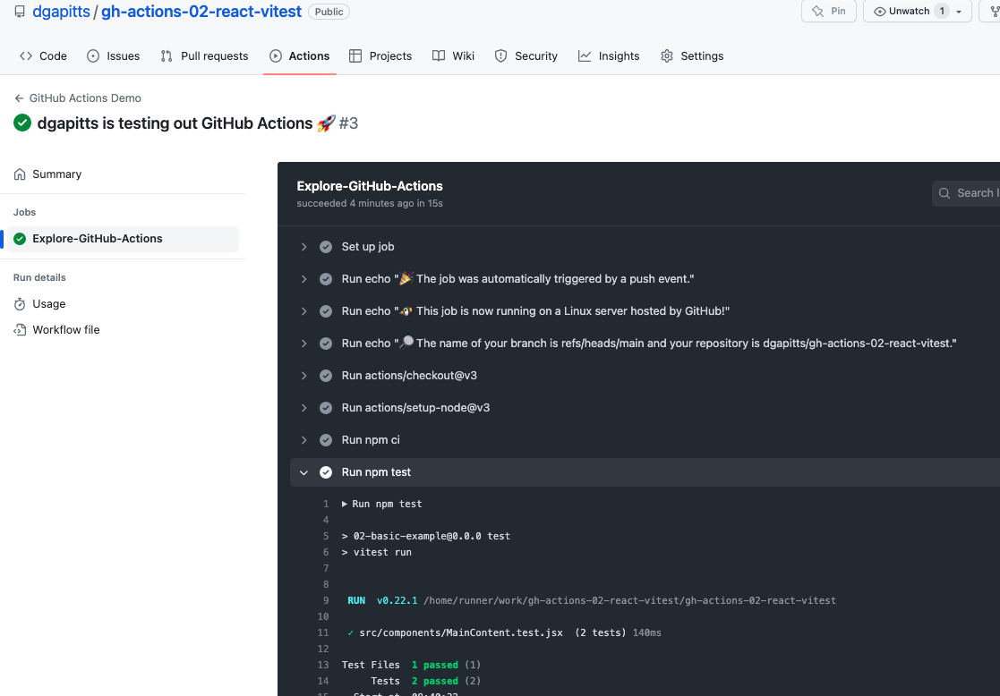

# gh-actions-02-react-vitest

Following 


As the Actions tab screenshot:



We can see the results from the automated tests, triggered by the push operation:
```
Run npm test

> 02-basic-example@0.0.0 test
> vitest run


 RUN  v0.22.1 /home/runner/work/gh-actions-02-react-vitest/gh-actions-02-react-vitest

 ✓ src/components/MainContent.test.jsx  (2 tests) 140ms

Test Files  1 passed (1)
     Tests  2 passed (2)
  Start at  09:40:32
  Duration  2.35s (transform 908ms, setup 111ms, collect 424ms, tests 140ms)
```

